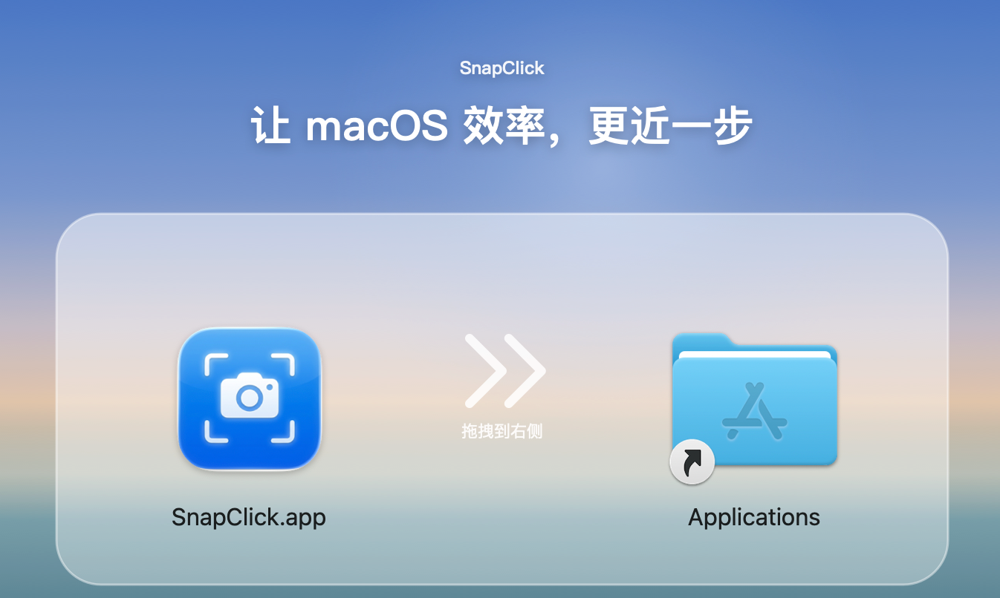
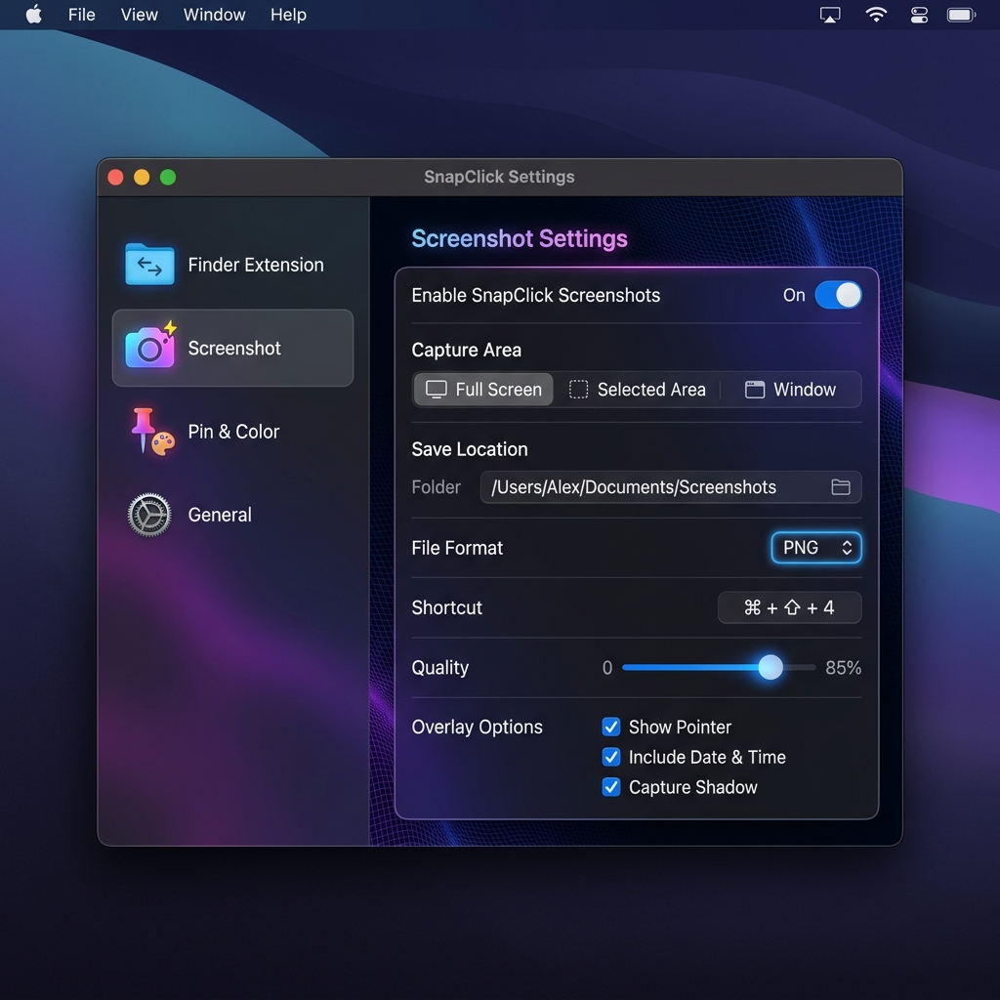
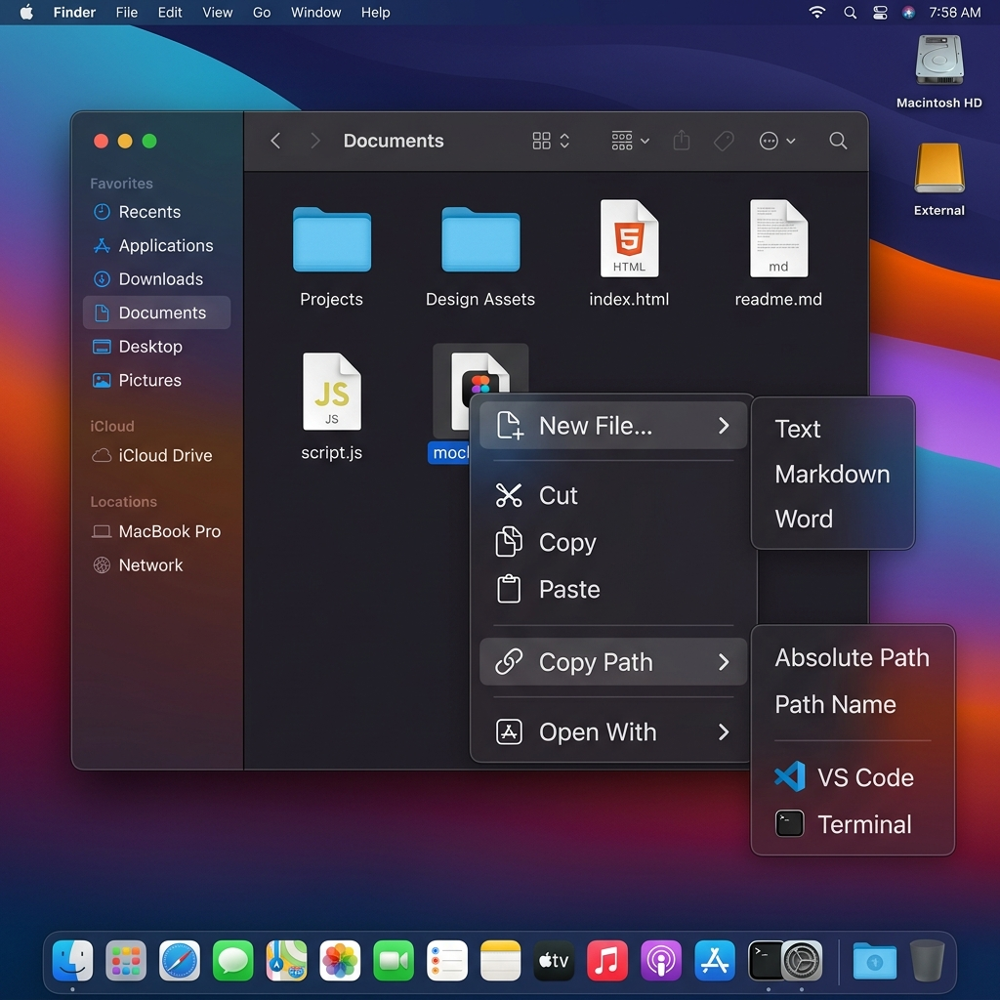
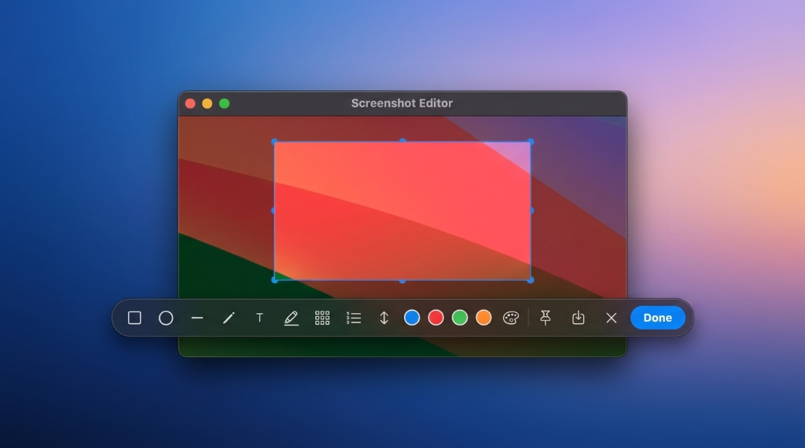
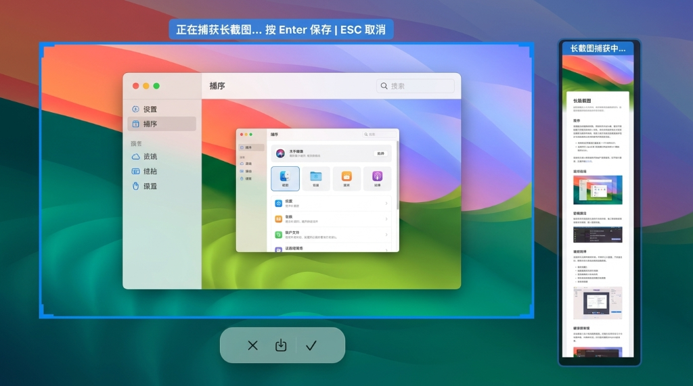
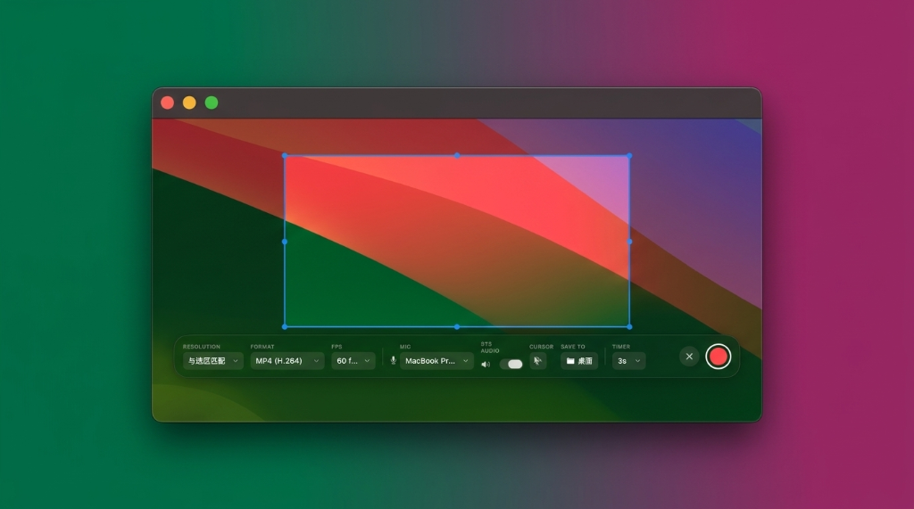
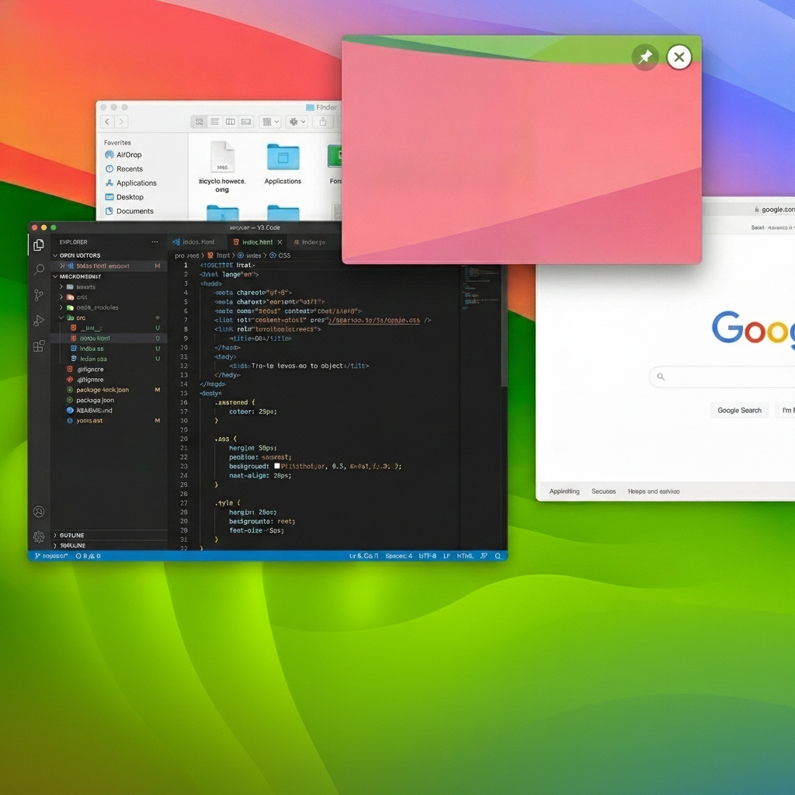
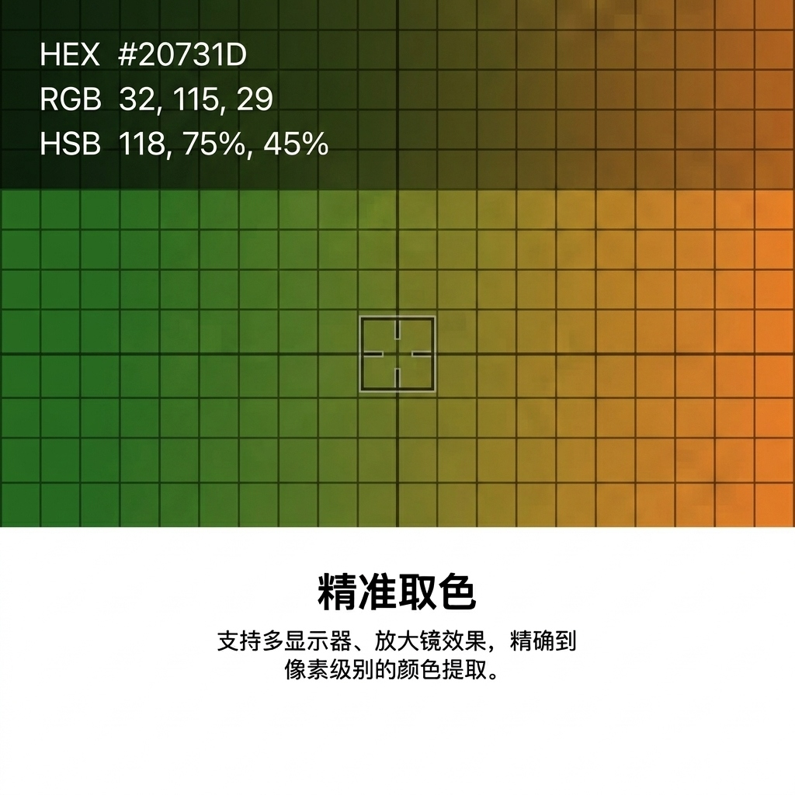

<div align="center">


### macOS 效率增强工具 — 右键增强 · 截图标注 · 屏幕录制 · 屏幕贴图 · 智能取色

[](https://github.com/Tyeerth/SnapClick/releases)
[](https://github.com/Tyeerth/SnapClick/releases)
[](https://swift.org)
[](LICENSE)
[](https://github.com/Tyeerth/SnapClick/releases/latest)

一款专为 macOS 打造的高级效率增强工具，将 Finder 菜单增强、高级截图标注、高性能录屏、屏幕贴图、智能取色等常用效率功能一体化汇总，以纯原生 Swift 架构呈现，为您提供丝滑般尊贵的使用体验。

[功能特性](#-功能特性) · [下载安装](#-下载安装) · [技术栈](#%EF%B8%8F-技术栈) · [编译构建](#-编译构建) · [项目结构](#-项目结构) · [联系作者](#-联系作者)

[English](README_EN.md)

<br />



</div>

***

## ✨ 功能特性

### 🔧 Finder 右键菜单增强

- **新建常用文件** — 右键一键新建 `.txt`、`.md`、`.docx`、`.xlsx`、`.pptx`、`.html`、`.css`、`.js`、`.py`、`.sh` 等多种格式文件，支持自定义模板，新建后自动进入重命名状态。
- **文件剪切与粘贴** — 比原生更简单的高效剪切粘贴流，支持跨目录快速移动。
- **快速移动/复制到** — 支持添加常用目录，一键归档。
- **路径高级拷贝** — 支持拷贝完整路径、仅文件名或 POSIX 规范路径。
- **常用终端/编辑器快捷打开** — 右键在当前目录拉起 Terminal、iTerm2、VS Code、Warp 或 Xcode。

<br>

<br>

***

### 📸 高级截图与标注

- **区域截图 & 智能窗口识别** — 拖拽自由选区、自动贴合悬停窗口，支持快捷键 ⌥⇧A 一键调起。
- **智能长截图捕获** — 支持滚动网页或超长文档，智能进行连续的长截图无缝捕捉。
- **高级标注编辑器** — 丰富的标注工具栏，支持矩形、椭圆、直线、箭头、文字、画笔、高亮蒙层、步骤序号以及像素级马赛克。
- **截图美化包装** — 优雅的毛玻璃大阴影、0-32px 自定义窗口圆角。

<br>
<div align="center">
  
  
</div>
<br>

***

### 🎥 高性能屏幕录制

- **底层SCK架构** — 基于 macOS 底层官方高性能 ScreenCaptureKit 架构，超低系统资源占用。
- **多维度选区录屏** — 支持自定义录屏区域、全屏录制、特定应用窗口录制。
- **极速高帧率录制** — 支持 30/60/120 FPS 极速高帧率与先进的 HEVC/H.264 编解码。
- **多声道混合** — 支持同时捕获系统声音（麦克风输入与系统音频流混合）。
- **HUD悬浮控制条** — 独立的浮动 HUD 控制面板，可快速进行录屏暂停、停止及时间、音频波形监视。

<br>

<br>

***

### 📌 便捷屏幕贴图 (Pin Window)

- **多视窗屏幕贴图** — 将截图或任意图像一键固定在屏幕最上层展示，快捷键为 ⌥⇧P。
- **悬浮多视窗管理** — 支持跨 Space 空间跟随，多贴图并存。
- **自由交互调节** — 支持滚轮无级调节贴图透明度，双击缩放大小，支持 Pin 状态快捷栏管理。

<br>

<br>

***

### 🔍 精准取色放大镜

- **16x精准放大镜** — 支持可视化 16 倍像素级放大镜，支持快捷键 ⌥⇧C 快速调起。
- **多格式一键转换** — 完美支持 HEX、RGB、HSL、Swift (NSColor) 与 CSS 等多种颜色代码一键复制。
- **取色历史** — 智能记录并展示最近取的 20 条颜色历史记录。

<br>

<br>

***

***

# 📥 下载安装

### 方式一：直接下载安装包（推荐）

前往 [Releases 页面](https://github.com/Tyeerth/SnapClick/releases/latest) 下载最新的 `.dmg` 或 `.zip` 安装包，解压后拖拽到「应用程序」文件夹即可运行。

<a href="https://github.com/Tyeerth/SnapClick/releases/latest">
  
</a>

### 方式二：从源码编译

请参阅下方 [编译构建](#-编译构建) 章节。

### ⚠️ 未签名应用的打开方法（重要）

由于本项目尚未加入 Apple 付费开发者计划，发布的安装包**未经过 Apple 公证签名**。首次打开时 macOS 的 Gatekeeper 会拦截，提示「**已损坏，无法打开**」或「**无法验证开发者**」。这并非应用本身有问题，按以下任一方法即可正常运行：

#### 方法一：移除隔离属性（推荐，最稳定）

将 App 拖入「应用程序」文件夹后，打开「终端」执行以下命令：

```bash
sudo xattr -dr com.apple.quarantine /Applications/SnapClick.app
```

输入开机密码（输入时不显示字符，属正常现象）后回车，再正常双击打开即可。

#### 方法二：通过系统设置放行

1. 双击打开 App，在弹出的拦截提示中点「**取消**」。
2. 前往「**系统设置 → 隐私与安全性**」，向下滚动到「安全性」区域。
3. 找到「已阻止使用 "SnapClick"」的提示，点击「**仍要打开**」。
4. 在再次弹出的对话框中点「**打开**」即可。

#### 方法三：右键打开

在「应用程序」中**右键点击** SnapClick → 选择「**打开**」→ 在提示框中再次点「**打开**」。
（注：若安装包提示「已损坏」，此方法可能无效，请改用方法一。）

> 💡 以上操作只需首次运行执行一次，之后即可像普通应用一样正常使用。

### ⚠️ 首次运行授权说明

首次启动时，为了功能正常运行，App 会引导您授予以下系统权限：

1. **屏幕录制权限** — 用于高性能截图、长截图、屏幕录制与放大镜取色。
2. **辅助功能权限** — 用于捕获并拦截全局快捷键。
3. **Finder 扩展启用** — 请前往「系统设置 → 通用 → 登录项与扩展 → Finder 扩展」中勾选启用 `FinderExtension`。

***

## 🏗️ 编译构建

### 前置要求

- macOS 13.0 (Ventura) 及以上
- Xcode 15.0 及以上
- Apple Developer Account（用于代码签名）

### 构建步骤

1. **克隆仓库**
   ```bash
   git clone https://github.com/Tyeerth/SnapClick.git
   cd SnapClick
   ```
2. **打开项目**
   ```bash
   open SnapClick.xcodeproj
   ```
3. **配置开发者签名** — 在 Xcode 的 `Signing & Capabilities` 中为以下两个 Target 配置您的开发团队 (Team)：
   - `SnapClick`（主 App，Bundle ID: `com.snapclick.app`，非沙盒特权模式）
   - `FinderExtension`（右键扩展插件，Bundle ID: `com.snapclick.app.FinderExtension`，沙盒模式，绑定 App Group: `group.4DAY66XCT4.com.snapclick.shared`）
4. **构建运行** — 选择 Scheme `SnapClick` → 构建目标 `My Mac` → 运行 (⌘R)

***

## 📂 项目结构

```
SnapClick/
├── Shared/                          # 主 App 与 FinderExtension 共享模块
│   ├── AppGroup.swift               # App Group 共享 UserDefaults 桥接
│   └── FileOperations.swift         # 文件操作核心（剪切/粘贴/新建/哈希/显示）
│
├── FinderExtension/                 # Finder 右键插件
│   ├── FinderSync.swift             # FIFinderSync 生命周期控制器
│   ├── MenuBuilder.swift            # 动态右键菜单构造引擎
│   ├── FinderExtension.entitlements
│   └── Info.plist
│
└── SnapClick/                       # 主 App
    ├── App/
    │   ├── SnapClickApp.swift       # SwiftUI 生命周期入口
    │   └── AppDelegate.swift        # AppKit 周期管理、命令分发
    ├── Core/
    │   ├── AppSettings.swift         # 全局 @AppStorage 配置项
    │   ├── PermissionManager.swift   # 系统权限检测与引导
    │   └── HotkeyManager.swift       # CGEventTap 全局快捷键
    ├── UI/
    │   ├── MainWindow.swift          # SwiftUI 多栏设置中心
    │   ├── WelcomeView.swift         # 首次启动授权引导页
    │   └── StatusBarController.swift # 菜单栏图标与下拉菜单
    └── Modules/
        ├── Screenshot/               # 截图与标注模块
        ├── PinColor/                 # 贴图与取色模块
        └── RightClick/               # 右键菜单设置模块
```

***

## 📮 联系作者

如果您在使用中遇到问题、有功能建议，或者想参与讨论，欢迎通过以下方式联系：

- **联系邮箱**：<tyeerth@163.com>
- **微信联系**： 

***

## 📄 开源协议

本项目基于 [Apache License 2.0](LICENSE) 开源协议。
